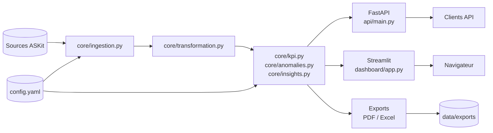
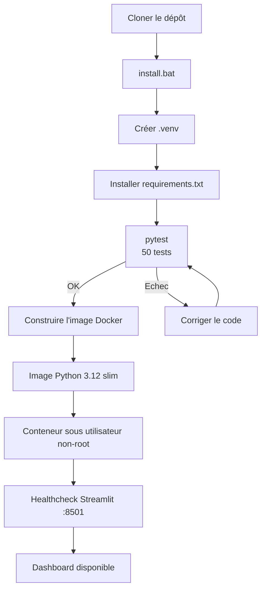
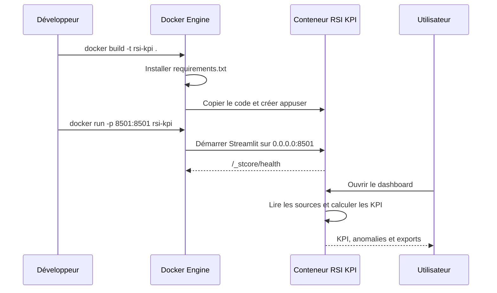

# Architecture - Automatisation KPI RSI

## Vue d'ensemble



```text
Sources ASKit
  - Tickets
  - Enquete satisfaction
  - Referentiel employes
        |
        v
core/ingestion.py
  Lecture CSV, CSV.GZ, Excel
        |
        v
core/transformation.py
  Standardisation colonnes, dates, statuts, jointures
        |
        v
core/kpi.py + core/anomalies.py
  KPI, tendances mensuelles, anomalies
        |
        +-------------------+
        |                   |
        v                   v
api/main.py           dashboard/app.py
FastAPI + Swagger     Streamlit
        |
        v
reports/pdf.py + reports/excel.py
Exports mensuels
```

## Flux DevOps local



## Déploiement Docker



## Commandes opérationnelles

```text
Installation      : install.bat
Dashboard local   : run_dashboard.bat
API locale        : run_api.bat
Rapport mensuel   : generate_report.bat
Tests             : .venv\Scripts\python.exe -m pytest -q
Docker             : docker build -t rsi-kpi .
```

## État DevOps

- Le conteneur utilise Python 3.12 slim et un utilisateur Linux non-root.
- Le dashboard possède un healthcheck Docker sur le port 8501.
- Les scripts Windows utilisent le virtualenv `.venv` du projet.
- Les secrets API doivent être fournis via la variable d'environnement `API_KEYS`.
- Aucun pipeline CI/CD n'est encore présent dans le dépôt ; les tests doivent donc être exécutés avant chaque build ou déploiement.

## Principes

- Le coeur metier est dans `core/`, reutilisable sans Streamlit.
- L'API et le dashboard utilisent les memes fonctions KPI.
- Les chemins et seuils sont centralises dans `config.yaml`.
- Les exports PDF/Excel sont generes dans `data/exports/`.
- Les tests unitaires couvrent transformation, KPI et anomalies.
